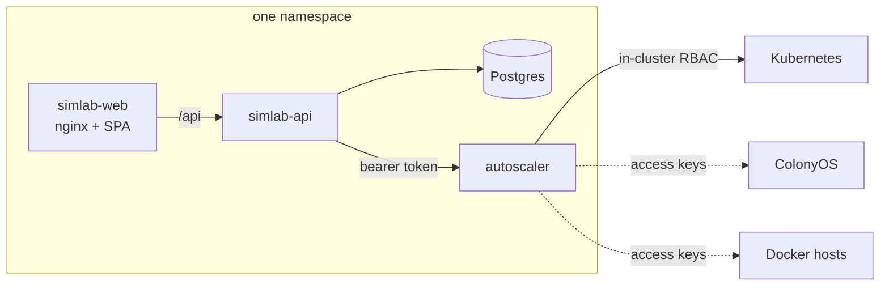

# The platform, in one namespace

Three services and a database: the autoscaler that makes and enacts scaling
decisions, the Simlab backend that drives it, the Simlab frontend, and a
Postgres for Simlab's runs.



## Installing

The three services live in three repositories, checked out side by side:

```
autoscale-platform/
├── autoscaler/
├── simlab-api/      ← this chart is in deploy/platform
└── simlab-web/
```

```bash
cd simlab-api/deploy/platform

helm dependency build

kubectl create namespace autoscale-platform

# One token, used by both halves. Anything unguessable will do.
TOKEN=$(openssl rand -hex 24)
kubectl -n autoscale-platform create secret generic autoscaler-token \
  --from-literal=api-token="$TOKEN"

helm install platform . \
  --namespace autoscale-platform \
  --set autoscaler.auth.existingSecret=autoscaler-token \
  --set simlab-api.autoscaler.existingSecret=autoscaler-token \
  --set autoscaler.persistence.storageClassName=<your class> \
  --set simlab-api.database.embedded.storageClassName=<your class> \
  --set simlab-web.ingress.enabled=true \
  --set simlab-web.ingress.host=simlab.example.org
```

Nothing else needs wiring. Each chart resolves the others by release name in
the same namespace, which is the point of installing them together.

For an install from a registry rather than from checkouts, replace each
`file://` repository in `Chart.yaml` with the OCI reference the charts are
published to. Nothing else changes.

## What has no default, and why

| Value | Why there is no default |
|---|---|
| `autoscaler.auth.token` / `existingSecret` | It guards a service holding Kubernetes tokens, ColonyOS private keys and Docker certificates. A chart that shipped one would ship a well-known credential; a chart that generated one silently would leave nobody able to say what it is. |
| `simlab-api.autoscaler.token` / `existingSecret` | The same token, from the other side. |
| `*.storageClassName` | Unset on a cluster with no default StorageClass, a PVC stays Pending forever with nothing in the pod's events to explain why. |

## Verifying it

`./verify.sh` runs the whole thing locally — both binaries, a real Postgres —
and checks it does what it claims: that one scenario replays identically under
two policies, that cloud burst actually reduces SLA breaches and what that
costs, that every scaling decision carries the engine's own reasoning, that
runs clean up the autoscaler targets they create, and that a settings change
reaches a running controller while a stale one is refused.

It is not a substitute for the unit suites — every service has its own, against
fakes that behave like the real thing. It is the one check that nothing
*between* the services has merely been assumed. It earned its place the first
time it ran, by finding a response that rendered nanoseconds for a field the
request took in seconds.

```
✓ every platform is reachable through simlab-api
✓ the scenario round-trips: what comes out can be sent back in
✓ both runs replayed the identical 13071 jobs — the seed held
✓ cloud burst cut SLA breaches from 10689 to 1489
✓ and it cost 62.3 cloud executor-hours to do it
✓ every one of 42 scaling decisions carries the engine's own reasoning
    P100 breaches in 1m0s at the current 0 executors; 3 needed
    (minimum 2 plus 1.15x safety) for 34 jobs waiting, 0.11/s arriving
✓ both runs cleaned up their autoscaler targets
✓ settings went from [1 50] to [2 77] on a running service, nothing restarted
✓ a stale write is refused, so two editors cannot clobber each other
```

## Running against real infrastructure

The install above brings up the platform with nothing registered. Simulation
runs need nothing further — they create their own targets. To scale something
real, register a target through the UI or the API:

- **kubernetes** — scales one Deployment per tier. It cannot see the queue, so
  such a target is driven.
- **colonyos-k8s** — creates and scales ColonyOS executor pods, and reads the
  queue from the ColonyOS server. It can run autonomously.
- **colonyos-container** — the same, as plain Docker containers on a host with
  no orchestrator.

The registration form is generated from each platform's own schema, so it asks
for exactly what that platform needs and marks the secret fields as secret.
