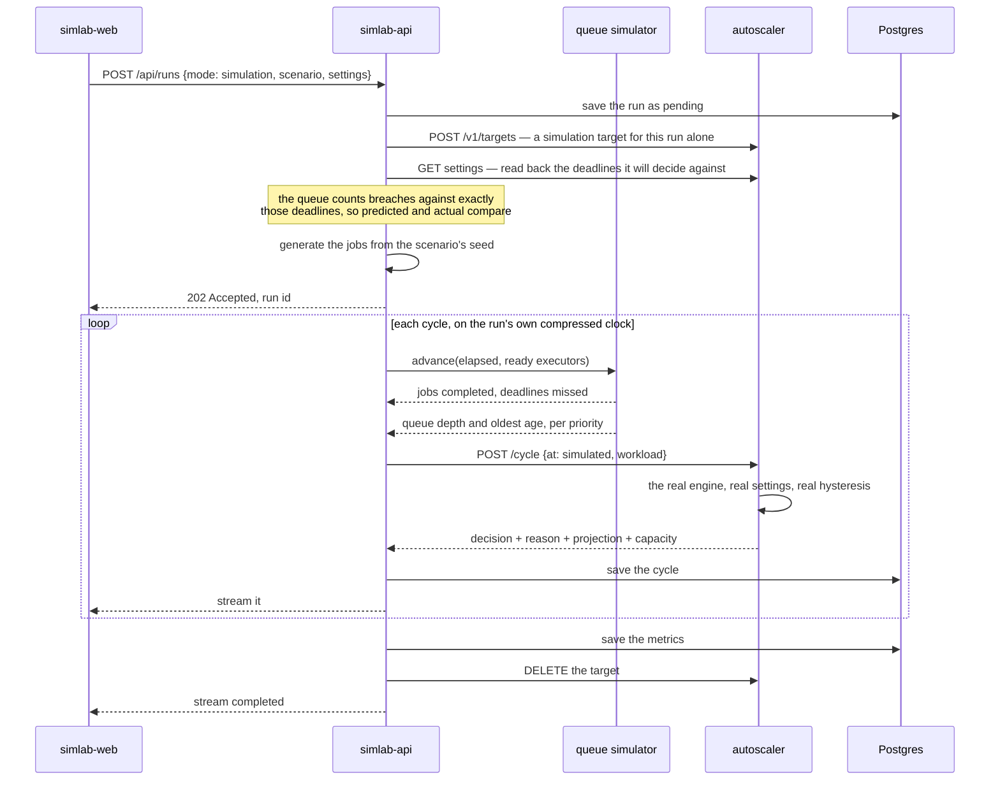
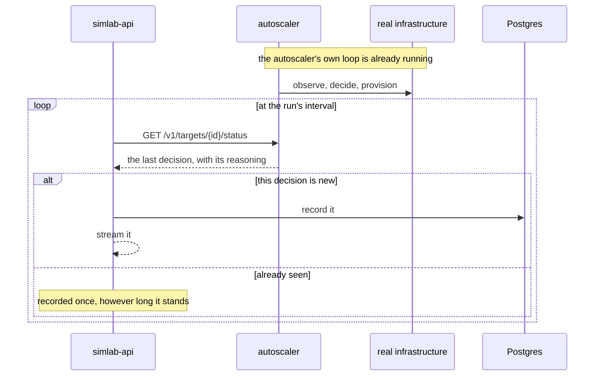
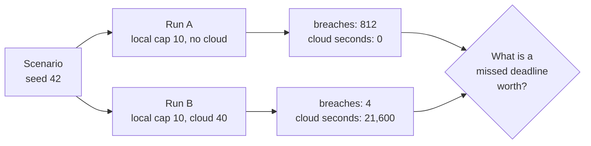
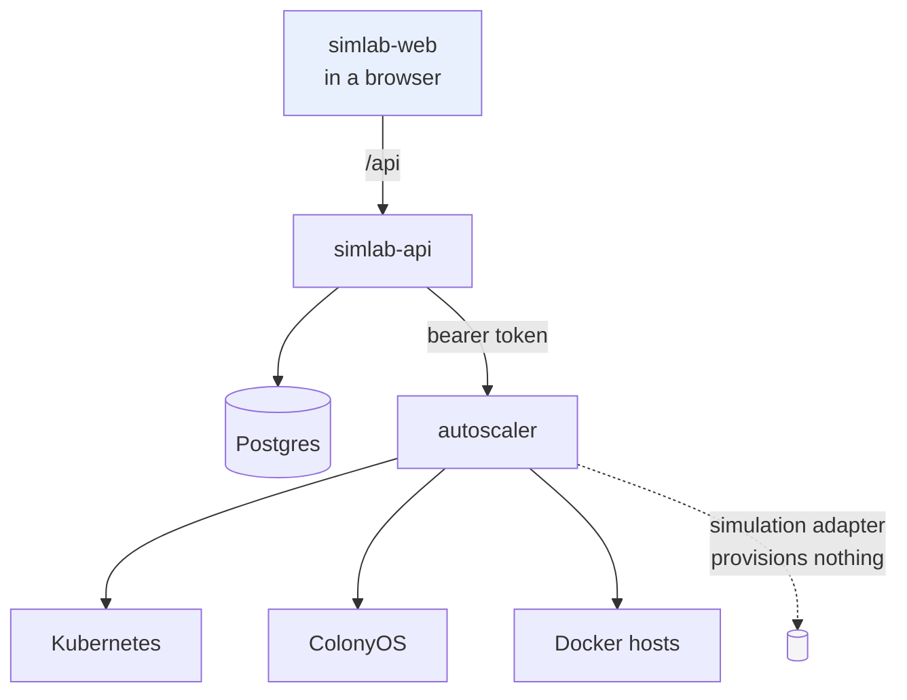

# How Simlab works

## A simulation run

The substitution happens at exactly one point — the autoscaler's simulation
adapter — and everything above it is the code that runs in production.

Two things in that diagram do most of the work. The deadlines are read back
from the target rather than taken from the run, so a breach is counted against
exactly the rule the controller was deciding under. And the target is created
and destroyed with the run, so no run ever starts holding executors a previous
one provisioned.

## A live run

Simlab watches. It does not drive: a second controller issuing decisions for
the same target would be two schedulers fighting over one fleet.

## Comparing two policies

The comparison the whole application exists to make. Same scenario, same seed,
same jobs; different settings.

Because the seed fixes the workload, the difference between those two columns
is attributable to the settings and nothing else. That is what makes it an
experiment rather than an anecdote.

## Who talks to whom

The browser never reaches the autoscaler. That token unlocks every platform
credential the autoscaler holds, and a token that reaches a browser has been
disclosed.
